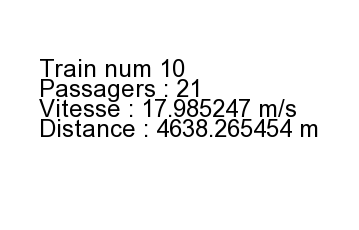

# Modélisation simplifiée d’un système de transport de type " VAL "

Projet CIR2 VAL.

## Table des matières

1. [Aperçu](#aperçu)
2. [Chiffres Clés](#chiffres-clés)
3. [Installation](#installation)
4. [Utilisation](#utilisation)

   - [Prérequis](#prérequis)
   - [Étapes pour lancer le programme](#étapes-pour-lancer-le-programme)
   - [Fonctionnalités de l&#39;interface](#fonctionnalités-de-linterface-sfml)
5. [Fonctionnalités Clés du Code](#fonctionnalités-clés-du-code)

   - [Gestion du mouvement des trains](#gestion-du-mouvement-des-trains)
   - [Gestion du temps dans la simulation](#gestion-du-temps-dans-la-simulation)
   - [Utilisation des threads pour la gestion simultanée](#utilisation-des-threads-pour-la-gestion-simultanée)
6. [Réussite du Projet](#réussite-du-projet)

   - [Objectifs Accomplis](#objectifs-accomplis)
   - [Défis Relevés](#défis-relevés)
   - [Défis non-relevés](#défis-non-relevés)
7. [Conclusions](#conclusions)
8. [Contact](#contact)

## Aperçu

Ce projet, développé en C++, se concentre sur la modélisation du fonctionnement du métro en utilisant des concepts de
multithreading. Il vise à reproduire le système de gestion des rames de métro et des stations.

Chaque rame est conçue pour fonctionner de manière relativement autonome, suivant un circuit fermé comprenant des
stations où elle effectue des arrêts. Les fonctionnalités principales de chaque rame incluent :

- **Circulation sur un circuit fermé** : Chaque rame suit un itinéraire prédéfini, s'arrêtant à des stations
  spécifiques.
- **Gestion de la vitesse et de l'accélération** : Les rames ajustent leur vitesse et leur accélération en fonction des
  paramètres définis.
- **Maintien d'une distance de sécurité** : Les rames maintiennent une distance de sécurité entre elles lorsqu'elles
  circulent sur des lignes séparées. Chaque rame effectue un trajet aller-retour sur des voies distinctes. Aux terminus,
  elles effectuent un demi-tour en utilisant une voie de réserve spécifique pour changer de direction et se positionner
  au départ de la ligne, sur le quai opposé.

Le système intègre également des stations autonomes qui gèrent l'afflux de passagers entrant et sortant de chaque rame.
L'interaction entre les rames et les stations crée un réseau dynamique visant à simuler le fonctionnement réel d'un
système de métro.

Ce projet met en avant la gestion autonome des rames en interaction avec un réseau de stations, visant à reproduire les
principes fondamentaux de fonctionnement du métro dans un environnement modélisé en C++.

Si votre projet est déjà sur un dépôt GitHub, voici comment vous pourriez ajouter la section d'installation avec la
commande `git clone` pour récupérer votre projet depuis le dépôt :

## Chiffres Clés

1. **Nombre de lignes de code** : 2300
2. **Durée de développement** : 3 mois

## Installation

Pour utiliser ce projet, vous devez avoir le fichier SFML.exe fourni sur JUNIA Learning de `Monsieur Pascal Mosbah`

1. **Téléchargement de SFML**

   - Télécharger le fichier SFML.exe depuis junia learning, ou installer sfml manuellement sous unix avec la commande suivante :

   ```bash
    $ sudo apt-get install libsfml-dev
   ```
2. **Récupération du projet depuis GitHub**

   - Clonez le dépôt GitHub "CIR2-VAL" en utilisant la commande suivante dans votre terminal :

   ```bash
   $ git clone https://github.com/username/CIR2-VAL.git
   ```

   Assurez-vous de remplacer `username` par votre nom d'utilisateur GitHub.

## Utilisation

### Prérequis

Assurez-vous que la bibliothèque SFML soit correctement installée et de bien avoir récupéré la dernière version du projet.

### Étapes pour lancer le programme

1. **Construction du projet**

   - Exécutez les commandes nécessaires pour construire le projet en utilisant le système de build.
2. **Lancement du programme**

   - Après la construction réussie du projet, lancez le programme en exécutant le fichier exécutable généré.
3. **Interface utilisateur SFML**

   - Lorsque le programme est lancé, l'interface utilisateur SFML devrait se charger.
   - Des informations supplémentaires peuvent être affichées dans la console, fournissant des détails sur le
     fonctionnement du programme et du système de métro simulé.
   - Certains paramètres peuvent être directement modifiés depuis l'interface, les autres sont modifiables depuis le fichier config.cpp.
4. **Observation et utilisation**

   - Observez le fonctionnement de l'interface SFML pour visualiser la simulation du système de métro.
   - Interagissez avec les fonctionnalités.

Ci-dessous, une capture d'écran de notre interface :


### Fonctionnalités de l'interface SFML

1. **Arrêt d'urgence des trains** : En appuyant sur le bouton jaune, cette action simule un arrêt d'urgence pour toutes
   les lignes de métro, illustrant ainsi la réaction du système en cas d'urgence.
2. **Molette de gestion de la vitesse du temps** : Permet de régler la vitesse de la simulation, accélérant ou
   ralentissant le défilement du temps dans la simulation du système de métro.
3. **Bouton de redémarrage** : Permet de réinitialiser le système à son état initial, relançant la simulation du réseau
   de
   métro.
4. **Molette de gestion de la distance de sécurité entre les trains** : Cette fonctionnalité permet de régler la
   distance de sécurité entre chaque train présents sur les différentes voies de manière dynamique, permettant ainsi
   d'observer l'impact sur le fonctionnement du réseau.
5. **Informations de chaque trains** : En appuyant précisément sur un train, cela affichera les informations détaillées
   de celui-ci.
   
6. **Figer le fonctionnement global** : En appuyant sur les boutons Start/Stop, cela permet d'arrêter et de relancer le
   fonctionnement globale des métros.

## Fonctionnalités Clés du Code

### Gestion du mouvement des trains

Les lignes de code responsables du mouvement des trains sont cruciales pour la simulation. Elles contrôlent le
déplacement des rames de métro le long du circuit défini, en tenant compte des variations de vitesse, des arrêts aux
stations et du mouvement aller-retour sur les lignes.
Nous avons voulu mettre en avant une approche réaliste. En effet, des recherches précises ont été faites pour que le
mouvement soit régit par des lois physique.

Source : https://www.tpline.net/fr/bras/tp2/ressources/Synthese-loi-trapeze-de-vitesse.pdf

```c++
void Train::stopX() {
    isStopping = true;
    decelerationDistance = pow(speed, 2) / (2 * DECELERATION_COEFF);

    if (decelerationDistance > 0 and speed > 0) {
        coordX += speed * REFRESH - 0.5 * DECELERATION_COEFF * pow(REFRESH, 2);
        speed -= DECELERATION_COEFF * REFRESH;

        // Assurez-vous que la vitesse ne devient pas négative
        if (speed < 0) {
            setSpeed(0);
        }
        // Mettre à jour la distance de décélération restante
        decelerationDistance -= speed * REFRESH;
    } else {
        // Le train est complètement arrêté
        setSpeed(0); // Assurez-vous que la vitesse est bien à 0
        return;
    }
}


void Train::moveX() {
    if (speed == 0) {
        time = 0;
        updateTotalCoordX();
        setCoordX(0);
    }

    if (isStopping and speed > 0) {
        time = 0;
        updateTotalCoordX();
        setCoordX(0);
        isStopping = false;
    }

    this->time += REFRESH;
    double NEW_MAX_SPEED = sqrt(
            (getNextStation()->getCoordX(getTerminus()->getDirection()) - (getTotalCoordX())) * COEFF_SPEED);
    double time1 = MAX_SPEED / COEFF_SPEED;
    double time2 =
            (getNextStation()->getCoordX(getTerminus()->getDirection()) - getTotalCoordX()) / MAX_SPEED;


    if (fullSpeed()) {
        if (getCoordX() <= getAccelerationDistance()) {
            setCoordX(0.5 * COEFF_SPEED * pow(this->time, 2));
            setSpeed(COEFF_SPEED * time);
        }

        if (getCoordX() > getAccelerationDistance() and
            getCoordX() < getNextStation()->getCoordX(getTerminus()->getDirection()) - getTotalCoordX()) {
            setCoordX(MAX_SPEED * (this->time - time1) + 0.5 * COEFF_SPEED * pow(time1, 2)
            );
            setSpeed(MAX_SPEED);
        }

        if (getCoordX() >= (getNextStation()->getCoordX(getTerminus()->getDirection()) - getTotalCoordX()) -
                           getAccelerationDistance()) {
            setCoordX(-0.5 * COEFF_SPEED * pow(this->time - time2, 2) + MAX_SPEED * (this->time - time2) +
                      MAX_SPEED * (time2 - time1) + 0.5 * COEFF_SPEED * pow(time1, 2));
            setSpeed(-COEFF_SPEED * (time - time2) + MAX_SPEED);
        }
    } else {
        time1 = NEW_MAX_SPEED / COEFF_SPEED;
        if (getCoordX() < getAccelerationDistance()) {
            setCoordX(0.5 * COEFF_SPEED * pow(this->time, 2));
            setSpeed(COEFF_SPEED * time);
        }

        if (getCoordX() >= (getNextStation()->getCoordX(getTerminus()->getDirection()) - getTotalCoordX()) -
                           getAccelerationDistance()) {
            setCoordX(-0.5 * COEFF_SPEED * pow(this->time - time1, 2) + NEW_MAX_SPEED * (this->time - time1) +
                      0.5 * COEFF_SPEED * pow(time1, 2)
            );
            setSpeed(-COEFF_SPEED * (time - time1) + NEW_MAX_SPEED);
        }
    }
}

```

### Gestion du temps dans la simulation

Le code relatif à la gestion des heures de la journée joue un rôle essentiel dans la simulation du système de métro. Il
permet de simuler le passage du temps, les changements d'affluence des passagers.
C'est un ajout intéressant qu'on a voulu implémenter dans notre code. Il nous a permit d'approfondir certains aspect
technique technique du métro. Afin de se rapprocher au mieux du métro que nous connaissons actuellement.
Son implémentation est simple, une class `heure` et un appel dans le tread principal.
Sa structure :

```c++

#ifndef
HEURE_H
#define
HEURE_H

#include
<iostream>
#include
<ctime>
#include
<iomanip>
#include
<unistd.h>
#include
<tuple>
#include
<thread>
#include
<chrono>

class Heure {
private:
int heures;
int minutes;
int secondes;
int millisecondes;
int microsecondes;

public:
/**
 * @brief Constructeur de la classe Heure
 * @param heures : heures
 * @param minutes : minutes
 * @param secondes : secondes
 * @param millisecondes : millisecondes
 * @param microsecondes : microsecondes
*/
Heure();
const std::tuple<int, int, int> getTime() const;
const int getHeures() const;
const int getMinutes() const;
const int getSecondes() const;
const int getMillisecondes() const;
const int getMicrosecondes() const;
void afficherHeure() const;
void incrementerTemps(double refresh);
void incrementerMinute();
void incrementerHeure();
void remiseAZero();
void ManageTime(Heure &temps, bool &stopWorking, std::mutex &mtxTemps);
};

#endif // HEURE_H
```

**Les commentaires / Doctrings ont été enlevé pour le rapport**

Cette implémentation de l'heure nous a permit de rajouter :

1. La fermeture des stations la nuit 01h - 07h
2. L'arret des trains après 01h.
3. L'accération de la simulation

### Utilisation des threads pour la gestion simultanée

L'utilisation de threads est une composante clé pour permettre un fonctionnement simultané et efficace des différents
aspects du système de métro simulé. Les threads sont utilisés pour gérer des tâches spécifiques telles que le mouvement
des rames, du rendu visuel et de la gestion de l'heure.

```c++

std::thread hourThread(ManageTime, std::ref(temps), std::ref(stop_working), std::ref(mtx_));;

std::thread renderThread;

if (DISPLAY) {
    renderThread = std::thread([&sharedData]() {
        sf::RenderWindow window(sf::VideoMode(WIDTH, HEIGHT), "Train Simulator");
        renderVisuals(window, sharedData);
    });
}

for (auto &line: metroLines) {
    for (auto &actualTrain: line->getTrains()) {
        threads.emplace_back(&MetroLine::manageLine, line,
                            std::ref(actualTrain),
                            std::ref(sharedData),
                            std::ref(mtx_),
                            std::ref(stop_working),
                            std::ref(temps));
    }
}

```

Ce que montre le code, est que chaque train forme un thread et est géré par la fonction `ManageSubway(..)`
Cette fonction est documenté et développé dans le fichier **src/TrainControlFunction.cpp**

## Réussite du Projet

Cette section vise à résumer les aspects clés de la réussite du projet de simulation du système de métro. Elle met en
lumière les objectifs atteints, les défis relevés et les conclusions tirées de cette expérience de développement.

### Objectifs Accomplis

- **Modélisation précise** : Réussite dans la modélisation précise du système de métro, en utilisant des principes
  physiques et algorithmiques pour simuler le comportement réaliste des rames et des stations.
- **Interface interactive** : Développement d'une interface utilisateur SFML interactive, offrant une représentation
  visuelle claire du système de métro et permettant une expérience immersive pour les utilisateurs.
- **Gestion des aspects temporels** : Intégration réussie de la gestion du temps dans la simulation, avec une variation
  dynamique des conditions de fonctionnement du système à différentes heures de la journée.

### Défis Relevés

- **Complexité de la modélisation** : Surmonter la complexité liée à la modélisation physique du mouvement des rames de
  métro tout en assurant la précision des calculs.
- **Optimisation des performances** : Optimiser l'utilisation des threads pour garantir une simulation fluide et
  efficace, même avec une charge de travail importante.
- **DocString & Commentaires** : Ajout de commentaire de documentation dans l'intégralité du code. La structure à aussi
  été soigneusement réfléchi.

## Défis non-relevés

### Heures d'Influence dans la Simulation

L'ajout d'une prise en compte plus détaillée des heures où l'influence sur le réseau de métro est plus ou moins forte a
été envisagé. La gestion complète de cette fonctionnalité au sein des classes existantes a été prévue, mais des
contraintes de temps ont empêché sa réalisation complète.

### Conclusions

### Conclusion personnelle :

#### Ugo Warembourg

Je suis satisfait de l'évolution du projet. J'ai trouvé particulièrement enrichissante l'approfondissement de certaines
notions, notamment celle relative à l'utilisation des threads dans le contexte du projet. L'organisation a été
efficacement gérée grâce à l'utilisation de listes de tâches (TO-DO lists) directement intégrées dans le projet.

#### Maxence Gibaru

Dès l'annonce de ce projet, j'ai tout de suite été enjoué à l'idée de réaliser ce genre de système relativement
complexe. J'ai pu aborder de nombreuses notions intéressantes comme les threads, ou encore les différentes structures de
classes qui me seront utiles pour la suite de mon apprentissage de la programmation.

## Contact

Adresse email de `Maxence` : maxence.gibaru@student.junia.com

Adresse email de `Ugo` : ugo.warembourg@student.junia.com
